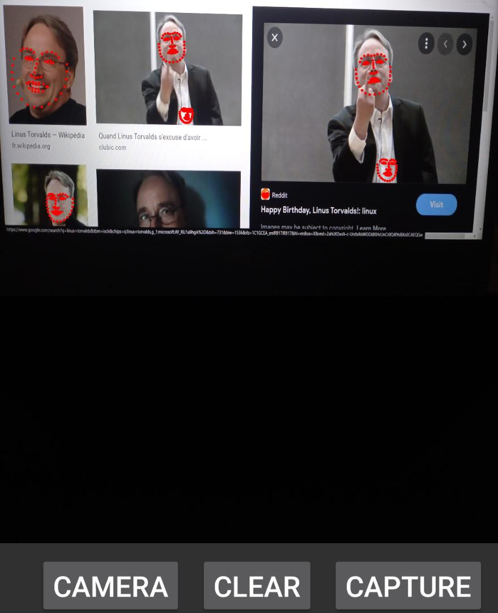

# DLib Android Face Landmark Detection
it's good to mention that this project is not a greatly optimised Implementation of face landmark detection it's kinda naive and simple one. :)

# Summary
It utilizes following libraries for making a face landmark detection system:

- [dlib](http://dlib.net/): This library was used natively with c++ for extracting face landmarks.

- [CamerView](https://github.com/natario1/CameraView): for capturing image from both mobile cameras (front & back) and processing frames in real time.

- [OpenCv](https://opencv.org/android/): OpenCv was used for due to the slow speed of ```dlib::frontal_face_detector()``` .

